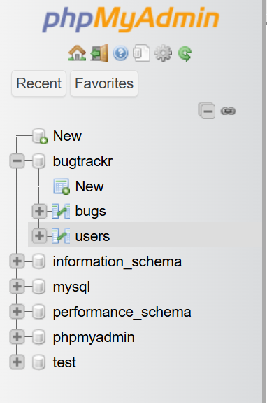

#  DefectDesk - Simple Bug Tracking System

DefectDesk is a lightweight PHP-based bug tracking system designed to help teams or individuals manage and report bugs efficiently. It features user authentication, bug submission, and role-based access.


## 🚀 Features

- 🔐 User Login & Role-based Access (Admin, Developer, Tester)
- 📝 Submit and View Bug Reports
- 👨‍💻 Admin Panel to Manage Users
- 🧾 Clean UI using Bootstrap 5
- 💾 Secure Database Integration using PDO
- while submitting the bug all developers will be get a email regarding the issue 

---

## 🛠️ Tech Stack

- **Frontend:** HTML, CSS, Bootstrap 5
- **Backend:** PHP 8+
- **Database:** MySQL (via PDO)
- **Server:** XAMPP / Apache

---

## 📁 Project Structure

```

DefectDesk/
├── dashboard/
│   ├── admin.php
│   ├── developer.php
│   └── tester.php
├── includes/
│   └── config.php
|   └── function.php -> mail() functionality
├── css/
├── js/
├── submit\_bug.php
├── view\_bug.php
├── manage\_users.php
├── login.php
├── logout.php
└── README.md

````

---

## 🧑‍💻 Getting Started

### 1. Clone the Repository

```bash
git clone https://github.com/your-username/DefectDesk.git
cd DefectDesk
````

### 2. Set Up Database

* Import the `DefectDesk.sql` file in phpMyAdmin.
* Update your database credentials in `includes/config.php`.

```php
$pdo = new PDO("mysql:host=localhost;dbname=DefectDesk", "root", "");
```

### 3. Run Locally

Ensure XAMPP or any local server is running:

```
http://localhost/DefectDesk/login.php
```

### 4. Best Option:
Install PHP server Extension from Vs code Extension
and run it from there
(easy to use)


### 🖼️ Index Page Preview

[](https://github.com/deepakmaur/DefectDesk)

### Tables in Database
[](https://github.com/deepakmaur/DefectDesk)


Deployed :- https://defectdesk.infinityfreeapp.com/index.php

mail() is not worrking there because mail() is often disabled.

